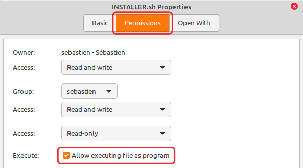

▲ [Full HD example here](https://raw.githubusercontent.com/SebastJava/plymouth-theme-mint-3/main/badge-preview.gif) (open in a new tab or window and press F11 !)

## mint-logo-3: 3 new Plymouth themes for Linux Mint
These are 3 new versions to choose from for your animated boot screen. These logos here are twice as large as the standard one. 200 pixels instead of 100. This works best on FHD screens, but it should work on smaller screens too.

| mint-logo-badge  | mint-logo-trident | mint-logo-Y-negative  |
| ------------- | ------------- | ------------- |
|  |  |  |

---
---

### How to install
1. [Download ZIP here](https://github.com/SebastJava/plymouth-theme-mint-3/archive/refs/heads/main.zip) (OR click on top-right green button "Code" and then click on "Download ZIP".)
1. Extract this entire zip.
1. Run one of these 3 installers in your terminal: `INSTALLER-badge.sh`, `INSTALLER-trident.sh`, or `INSTALLER-Y-neg.sh`. (Check screenshot above for permissions if needed...)
1. Restart and check the results!

### How to revert to the original mint-logo
1. Run `REVERT.sh` in your terminal. (Check screenshot above for permissions if needed...)
1. Restart and check the results!

### How to check things (optional)
You can check things with this command:
`update-alternatives --display default.plymouth`

You can also preview your default Plymouth theme using the `PREVIEW.sh` script. This will preview the splash screen for 10 seconds.