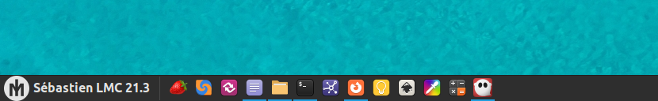

[Full HD example here](https://raw.githubusercontent.com/SebastJava/plymouth-theme-mint-3/main/badge-preview.gif) (open in a new tab or window and press F11 !)

## mint-logo-3: new Plymouth themes for Linux Mint

These are 3 new versions to choose from for your animated boot screen. These logos here are twice as large as the standard one. 200 pixels instead of 100. This works best on FHD screens, but it should work on smaller screens too.


This is all unofficial. I just needed a bigger logo for my startup screen, and then i added my special editions...

This is all based on the same two-step engine as the current mint-logo Plymouth theme. In fact, it is just a duplicate. Only the images got changed, and double-sized. That way I'm pretty sure it's technically okay and there's nothing missing.

### How to install

1. [Download ZIP here](https://github.com/SebastJava/plymouth-theme-mint-3/archive/refs/heads/main.zip) (OR click on top-right green button "Code" and then click on "Download ZIP".)
1. Extract this entire zip.
1. Run one of these 3 installers in your terminal: `INSTALLER-badge.sh`, `INSTALLER-trident.sh`, or `INSTALLER-Y-neg.sh`. (Check [Troubleshooting](https://github.com/SebastJava/plymouth-theme-mint-3#troubleshooting) if needed...)
1. Restart and check the results!

### How to revert to the original mint-logo

1. Run `REVERT.sh` in your terminal. (Check [Troubleshooting](https://github.com/SebastJava/plymouth-theme-mint-3#troubleshooting) if needed...)
1. Restart and check the results!

### Extras: login screen and menu icon

Included in the installation processes are 3 login screens and 3 menu icons. Feel free to use them or not.



You can select them using your graphical user interface (GUI). For example, in Cinnamon, you can right-click on the menu icon to configure the menu and choose an icon from there. And you can open your login window configuration from the menu (or do `pkexec lightdm-settings`) and change your login wallpaper from there.

* The extra icons are in `/usr/share/icons/SebastJava-logo`.
* The login wallpapers are in `/usr/share/backgrounds`.

### Troubleshooting

If you are having trouble running one of the INSTALLERs or REVERT scripts, open a terminal and do as follow:

```
# Go to this downloaded and extracted directory.
# EXAMPLE:
cd ~/Downloads/plymouth-theme-mint-3-main

# Make sure all the scripts are allowed to execute:
chmod +x INSTALLER-*.sh PREVIEW.sh REVERT.sh

# Choose to run one of the 3 installers this way:
./INSTALLER-badge.sh # -or-
./INSTALLER-trident.sh # -or-
./INSTALLER-Y-neg.sh # -or-
```